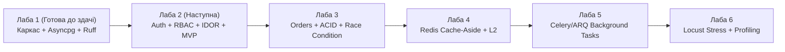

# 🗺️ Дорожня карта (Roadmap) розвитку проєкту «RuneDrive»
## Дисципліна: Розробка високонавантажених систем на Python
**Викладач:** доц. Красовський С. В.
**Студент:** Казімір Віталій, 4 курс, група 443Б (підгрупа 1)
**Проєкт:** Маркетплейс кібернетичних та магічних модифікацій «RuneDrive»
**Тематичний напрям:** Варіант №10 (Креативний Sci-Fi/Fantasy e-commerce з розподіленим кешуванням та flash-sale сценаріями)

---

## 🎯 Загальна мета еволюції проєкту
Послідовна трансформація модульного асинхронного бекенду в повноцінну розподілену високонавантажену платформу, стійку до пікових навантажень (Flash Sales), станів гонитви (Race Conditions) та сплесків читання каталогу, із забезпеченням суворого контролю якості, безпеки (RBAC/IDOR) та спостережуваності (Observability).

---

## 📅 Поетапний план реалізації по лабораторних роботах



---

### 🛠️ Лабораторна робота №1: Архітектура, каркас та інженерна культура (ГОТОВА ДО ЗДАЧІ)
* **Статус:** 🟢 100% готовність до здачі (очікує захисту на 10/10 балів).
* **Стек:** FastAPI, PostgreSQL 16, `asyncpg`, SQLAlchemy 2.0 Async, Docker Compose, Ruff, Pre-commit.
* **Реалізовано:**
  1. Декларативна модульна архітектура (Clean/Layered Architecture) з розділенням на `core`, `models`, `schemas`, `api`.
  2. Базові сутності: модель товару `Item` з використанням двійкового `JSONB` для довільних характеристик модифікацій (імпланти, руни, зілля) та базовий міксин `TimestampMixin` з первинними ключами `UUIDv4`.
  3. Liveness (`/health`) та Readiness (`/ready` з реальним пінгом PostgreSQL через пул з'єднань з `pool_pre_ping=True`).
  4. Інфраструктура автоматичного контролю стилю та синтаксису (Ruff у 10–100 разів швидший за flake8/black, Git pre-commit хуки).

---

### 🚀 Лабораторна робота №2: Користувачі, автентифікація, розмежування доступу та MVP бізнес-логіка
* **Мета:** Закладення фундаменту безпечної взаємодії користувачів із платформою, захист від атак авторизації та доведення системи до рівня працюючого MVP.
* **Стек:** `python-jose` (JWT токени) або `PyJWT`, `pwdlib` / `passlib` (гешування паролів за стандартом Argon2id / bcrypt), `pytest` + `httpx`.
* **Заплановані етапи реалізації:**
  1. **Модель користувача (`User`):**
     * Поля: `id` (UUIDv4), `email` (унікальний індекс), `username`, `hashed_password`, `role`, `balance` (кредити/золото), `is_active`, таймстеми.
     * Рольова модель (**RBAC**):
       * `BUYER` (звичайний покупець модифікацій);
       * `MERCHANT` / `RIPPERDOC` (продавець / підпільний інженер, що публікує свої модифікації);
       * `ADMIN` (системний адміністратор платформи).
  2. **Система автентифікації:**
     * Ендпоінти `/api/v1/auth/register` (реєстрація покупців та мерчантів).
     * Ендпоінт `/api/v1/auth/login` (отримання безпечного асинхронного JWT Access Token).
     * Залежності FastAPI (`Depends`) для вилучення поточного користувача: `get_current_user`, `get_current_active_user`.
  3. **Розмежування прав та авторизація:**
     * **Вертикальний контроль:** ендпоінти адміністрування (керування статусами, системна статистика) доступні лише ролі `ADMIN`, інакше — статус `403 Forbidden`.
     * **Горизонтальний контроль (захист від IDOR — Insecure Direct Object Reference):** покупець або продавець не може редагувати чи видаляти чужі товари та дані профілю. Перевірка власності (`item.owner_id == current_user.id`), інакше повертається `403 Forbidden`.
  4. **Доведення функціоналу до MVP:**
     * Повноцінний CRUD для товарів із прив'язкою до продавця.
     * Особистий кабінет (`/api/v1/users/me`) з можливістю перегляду та редагування власних даних.
  5. **Автоматизовані тести Pytest (100% покриття сценаріїв безпеки):**
     * Анонімний доступ до захищених маршрутів ➔ `401 Unauthorized`.
     * Валідний логін та перевірка видачі токена ➔ `200 OK`.
     * Помилка при некоректному паролі ➔ `401 Unauthorized`.
     * Спроба звичайного покупця викликати адмін-роут ➔ `403 Forbidden`.
     * Спроба користувача змінити чужий товар (IDOR) ➔ `403 Forbidden`.

---

### 📦 Лабораторна робота №3: Транзакційна бізнес-логіка замовлень та захист від Race Condition (Flash Sales)
* **Мета:** Реалізація складних фінансових транзакцій покупки, списання залишків та запобігання стану гонитви при пікових розпродажах обмежених товарів.
* **Стек:** PostgreSQL ACID-транзакції, SQLAlchemy Async Session, версійні міграції **Alembic**.
* **Заплановані етапи реалізації:**
  1. **Моделі `Order` та `OrderItem`:**
     * Зв'язок «один до багатьох»: замовлення, перелік позицій, зафіксована ціна на момент купівлі, статус (`PENDING`, `PAID`, `CANCELLED`).
  2. **Сценарій Flash Sale та боротьба з Race Condition:**
     * Ситуація: на складі залишився 1 рідкісний артефакт «Кіроші Mk.3», але 500 покупців одночасно відправили запит на покупку.
     * Реалізація захисту на рівні реляційної БД за допомогою песимістичного блокування рядка:
       ```sql
       SELECT * FROM items WHERE id = :item_id FOR UPDATE;
       ```
     * Атомарна перевірка достатності залишку (`stock_quantity >= requested_quantity`) та балансу користувача в межах єдиної транзакції (`engine.begin()`).
  3. **Alembic міграції:**
     * Перехід від автостворення схеми до строгих відтворюваних міграцій бази даних.

---

### ⚡ Лабораторна робота №4: Багаторівневе кешування через Redis (Cache-Aside Pattern)
* **Мета:** Розвантаження дискової підсистеми PostgreSQL на 90%+ під час екстремального напливу користувачів на перегляд каталогу.
* **Стек:** Redis 7 (aioredis / redis-py async), Serialization (orjson / msgpack).
* **Заплановані етапи реалізації:**
  1. **Патерн Cache-Aside:**
     * При запиті `GET /api/v1/items/` сервіс спочатку перевіряє наявність розпарсеного списку товарів у пам'яті Redis.
     * При хіті (Cache Hit) дані повертаються за < 2 мс без звернення до Postgres.
     * При промаху (Cache Miss) дані вичитуються з Postgres, записуються в Redis із TTL (Time To Live, наприклад 60 с) та повертаються клієнту.
  2. **Інвалідація кешу:**
     * При створенні, оновленні чи зміні залишку товару відповідні ключі кешу миттєво інвалідуються (видаляються).
  3. **Розподілений лічильник замовлень:**
     * Використання атомарного `INCR` / `DECR` у Redis для надшвидкого відсікання зайвих запитів ще до звернення до основної БД.
  4. **Порівняльні заміри затримок:**
     * Фіксація латентності (p95, p99) з кешуванням та без нього.

---

### 📨 Лабораторна робота №5: Асинхронні фонові задачі та брокери повідомлень (EDA)
* **Мета:** Забезпечення неблокуючого HTTP-відгуку шляхом винесення тривалих I/O та CPU операцій у фонові воркери.
* **Стек:** Брокер повідомлень (Redis / RabbitMQ), воркери **ARQ** або **Celery**, `ReportLab` / `weasyprint` для генерації документів.
* **Заплановані етапи реалізації:**
  1. **Подієва архітектура (Event-Driven Architecture):**
     * Після успішної фіксації замовлення HTTP-ендпоінт миттєво повертає клієнту `202 Accepted` або `201 Created` з ID замовлення.
     * Подія `order_created` відправляється в чергу брокера.
  2. **Фонові воркери:**
     * Воркер вичитує задачу з черги:
       1. Генерує криптографічно підписаний сертифікат/ліцензію на цифрову руну (PDF-чек);
       2. Емулює відправку повідомлення в нейромережу покупця (Webhook / Email сповіщення);
       3. Оновлює аналітичні агрегати продажів.
  3. **Перевага для Highload:**
     * Жоден тривалий сторонній виклик не затримує потік веб-сервера.

---

### 📊 Лабораторна робота №6: Навантажувальне тестування, профайлінг та фінальна оптимізація
* **Мета:** Виявлення вузьких місць платформи під екстремальним навантаженням (1000–5000 RPS), профайлінг коду та демонстрація досягнутої пропускної здатності.
* **Стек:** **Locust** (або k6 / wrk), `cProfile`, `yappi`, `tracemalloc`, GIN-індекси PostgreSQL.
* **Заплановані етапи реалізації:**
  1. **Стрес-тестування в Locust:**
     * Симуляція 1000 віртуальних користувачів: 90% переглядають каталог (читання з Redis), 10% беруть участь у флеш-розпродажі (конкурентні транзакції).
     * Зняття графіків RPS, часу відгуку (Response Time) та відсотка помилок (Failure Rate).
  2. **Профайлінг та усунення вузьких місць:**
     * Аналіз споживання пам'яті через `tracemalloc`.
     * Додавання **GIN-індексів** на поле `specs` (`JSONB`) для оптимізації фільтрації за внутрішніми атрибутами.
     * Тюнінг розміру пулу з'єднань (`pool_size`, `max_overflow`).
  3. **Підсумковий порівняльний звіт:**
     * Демонстрація зростання показників продуктивності від Лаби 1 до Лаби 6.

---

## 🏆 Результат для викладача
Цей план:
1. Повністю покриває лекційні теми курсу (DIA/CIA системи, кешування, блокування, масштабування, черги завдань, оптимізація).
2. Чітко узгоджується з офіційним завданням Лабораторної роботи №2 (RBAC, IDOR, Pytest).
3. Дозволяє розробляти та здавати компоненти **наперед**, оскільки кожна наступна робота спирається на чітко закладені інтерфейси попередньої.
