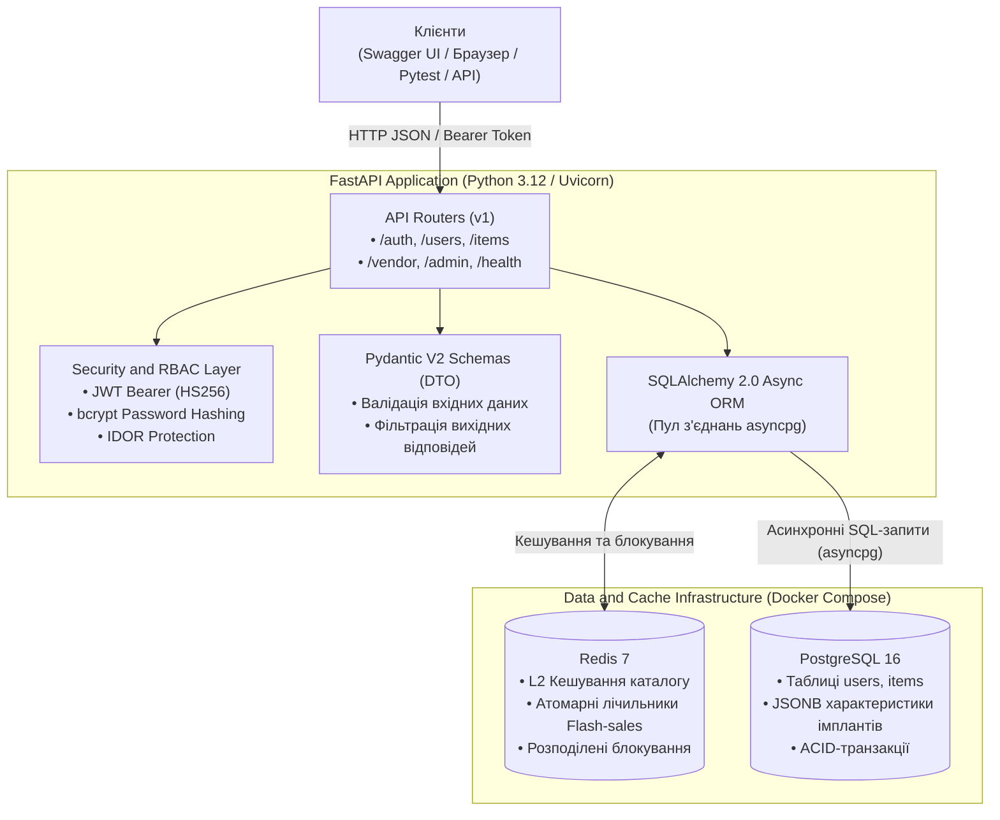

# Архітектурна специфікація системи «RuneDrive»

## 1. Загальний опис та обґрунтування предметної області
**RuneDrive** — це високонавантажена цифрова платформа (E-commerce / Digital Distribution), що спеціалізується на торгівлі кібернетичними імплантами, цифровими магічними рунами (прошивками) та алхімічними еліксирами у всесвіті Arcanepunk.

### Чому обрана ця предметна область для Highload-курсу:
1. **Екстремальні пікові навантаження (Flash Sales):** Рідкісні артефакти (наприклад, імплант «Кіроші Mk.3» або «Еліксир нескінченної мани») викидаються обмеженим тиражем (наприклад, 100 одиниць на 50 000 користувачів). Це ідеальний полігон для вивчення Race Condition, оптимістичних та песимістичних блокувань (`SELECT ... FOR UPDATE`), атомарних операцій у Redis (`DECR`, Lua-скрипти).
2. **Гетерогенні дані (JSONB):** Різні категорії товарів мають кардинально різні специфікації (імпланти потребують параметрів слотів, напруги та нейросумісності; зілля — час дії, об'єм та температуру). Використання PostgreSQL `JSONB` демонструє переваги комбінації реляційної надійності та документного NoSQL підходу.
3. **Розподіл I/O-bound та CPU-bound навантаження:**
   - **I/O-bound:** пошук за каталогом, фільтрація за характеристиками, транзакційна фіксація замовлень.
   - **CPU-bound:** валідація цифрових підписів токенів та рун, криптографічна перевірка ліцензій на прошивки.

---

## 2. Реальна архітектура системи (Mermaid)

---

## 3. Компоненти системи та їх відповідальність

| Компонент | Технологія | Роль у системі |
| :--- | :--- | :--- |
| **API Backend** | FastAPI (Python 3.12 + Uvicorn) | Асинхронна неблокуюча обробка HTTP-запитів (ASGI), маршрутизація, автоматична генерація OpenAPI / Swagger UI. |
| **Шар безпеки (Auth & RBAC)** | PyJWT + Passlib (bcrypt) | Stateless автентифікація за JWT-токенами, хешування паролів із сіллю, перевірка ролей (BUYER, RIPPERDOC, ADMIN) та захист від IDOR. |
| **Шар передачі даних (DTO)** | Pydantic V2 | Сувора типізація та валідація вхідних запитів, серіалізація та захист від витоку внутрішніх полів моделей. |
| **База даних (RDBMS)** | PostgreSQL 16 + asyncpg | Надійне транзакційне збереження даних користувачів та товарів, підтримка JSONB-специфікацій для гнучких характеристик артефактів. |
| **In-Memory сховище** | Redis 7 | L2-кешування вибірок каталогу для розвантаження бази, атомарні операції та розподілені блокування. |
| **Контроль якості та тести** | Pytest, Ruff, Pre-commit | Наскрізне асинхронне тестування бізнес-логіки та матриці доступу, лінтинг та форматування коду. |
