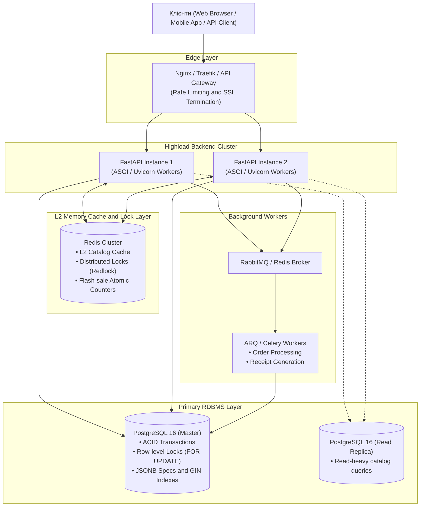

# 🏛️ Архітектурна специфікація системи «RuneDrive»

## 1. Загальний опис та обґрунтування предметної області
**RuneDrive** — це високонавантажена цифрова платформа (E-commerce / Digital Distribution), що спеціалізується на торгівлі кібернетичними імплантами, цифровими магічними рунами (прошивками) та алхімічними еліксирами у всесвіті Arcanepunk.

### Чому обрана ця предметна область для Highload-курсу:
1. **Екстремальні пікові навантаження (Flash Sales):** Рідкісні артефакти (наприклад, імплант «Кіроші Mk.3» або «Еліксир нескінченної мани») викидаються обмеженим тиражем (наприклад, 100 одиниць на 50 000 користувачів). Це ідеальний полігон для вивчення Race Condition, оптимістичних та песимістичних блокувань (`SELECT ... FOR UPDATE`), атомарних операцій у Redis (`DECR`, Lua-скрипти).
2. **Гетерогенні дані (JSONB):** Різні категорії товарів мають кардинально різні специфікації (імпланти потребують параметрів слотів, напруги та нейросумісності; зілля — час дії, об'єм та температуру). Використання PostgreSQL `JSONB` демонструє переваги комбінації реляційної надійності та документного NoSQL підходу.
3. **Розподіл I/O-bound та CPU-bound навантаження:**
   - **I/O-bound:** пошук за каталогом, фільтрація за характеристиками, транзакційна фіксація замовлень.
   - **CPU-bound:** валідація цифрових підписів рун, криптографічна перевірка ліцензій на прошивки.

---

## 2. Діаграма архітектури системи (Mermaid)

---

## 3. Компоненти системи та їх відповідальність

| Компонент | Технологія | Роль у високонавантаженій архітектурі |
| :--- | :--- | :--- |
| **Edge / Gateway** | Nginx / Reverse Proxy | Балансування навантаження між воркерами, відсікання зловмисного трафіку (DDoS / Rate Limit), кешування статичних ресурсів. |
| **API Backend** | FastAPI (Python 3.12) | Асинхронна неблокуюча обробка HTTP-запитів за стандартом ASGI, надшвидка серіалізація через Pydantic V2 на Rust. |
| **RDBMS** | PostgreSQL 16 | Надійне зберігання замовлень, користувачів та каталогу. Захист цілісності даних при списанні залишків. |
| **L2 Кеш і Блокування** | Redis 7 | Агресивне кешування топ-вибірок товарів для зменшення навантаження на диск БД; розподілені блокування для запобігання Race Condition. |
| **Контроль якості** | Ruff і Pre-commit | Автоматизована перевірка синтаксису, безпеки та стилю коду перед фіксацією у версійному сховищі. |
